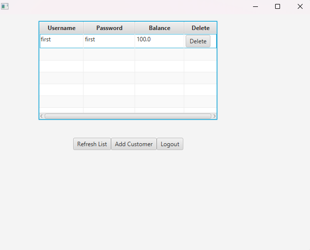
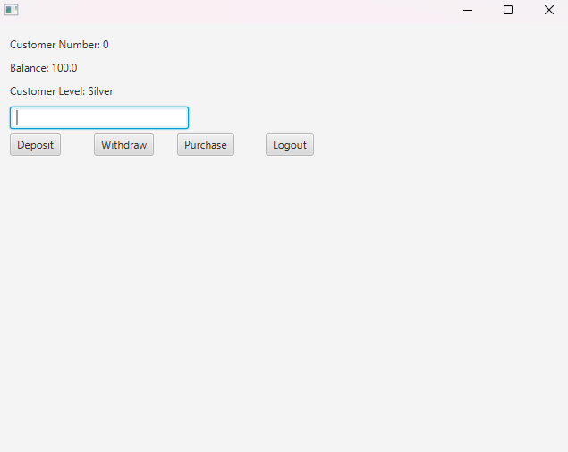
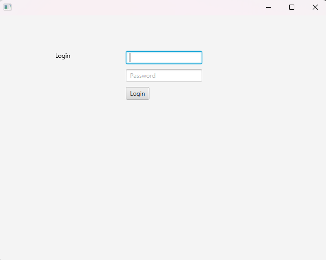
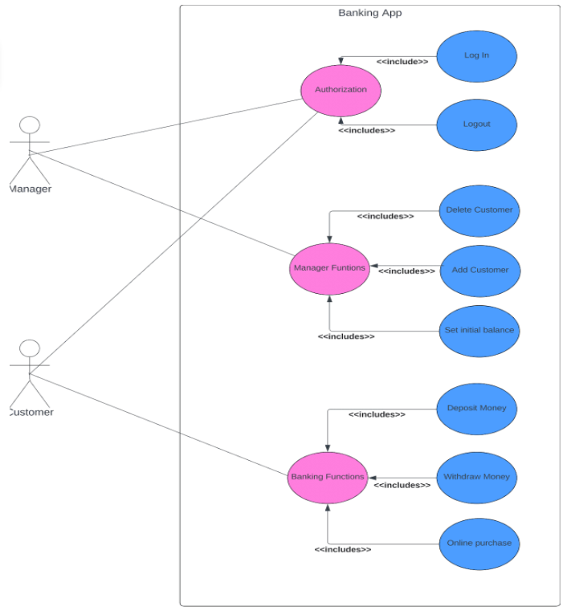
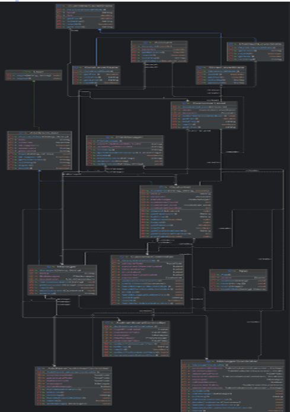

# Banking Management System

## Introduction

This is a simple banking management system that allows users to create an account, deposit money, withdraw money, and check their balance. The system is written in Java and uses a simple text-based interface.

### Understanding the Users
My Bank Account Application supports two types of users: the Manager and the Customer.
#### Manager
The Manager is responsible for maintaining the integrity of the banking system within the application, utilizing functions like login, logout, customer addition, and deletion.

#### Customer
My application allows customers to perform essential banking tasks like depositing, withdrawing, checking balances, and online purchases, categorizing them into Silver, Gold, or Platinum levels based on account balance.

### Authentication and Authority
Banking applications require rigorous authentication for both Managers and Customers. Managers' credentials are hardcoded, while customers' information is stored separately. The application uses a simple text file to store customer data, which is read and written to during runtime.
### GUI Development with JavaFX
JavaFX is used to create an intuitive Bank Account Application GUI, offering a seamless banking experience for both managers and customers, with its rich UI controls and scene graph architecture.

### Diagrams
The following diagrams illustrate the use case and class diagrams for the banking management system. They may be hard too read, but they provide a high-level overview of the system's functionality and structure.
#### Use Case Diagram

#### Class Diagram

